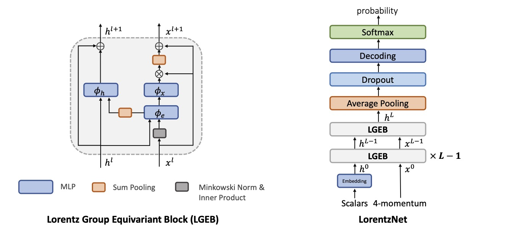
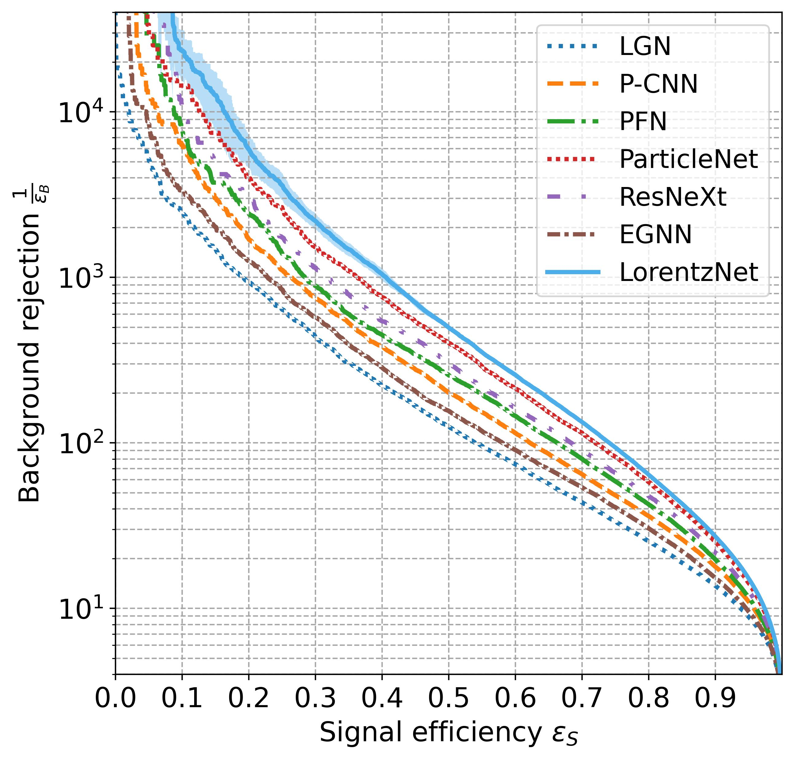
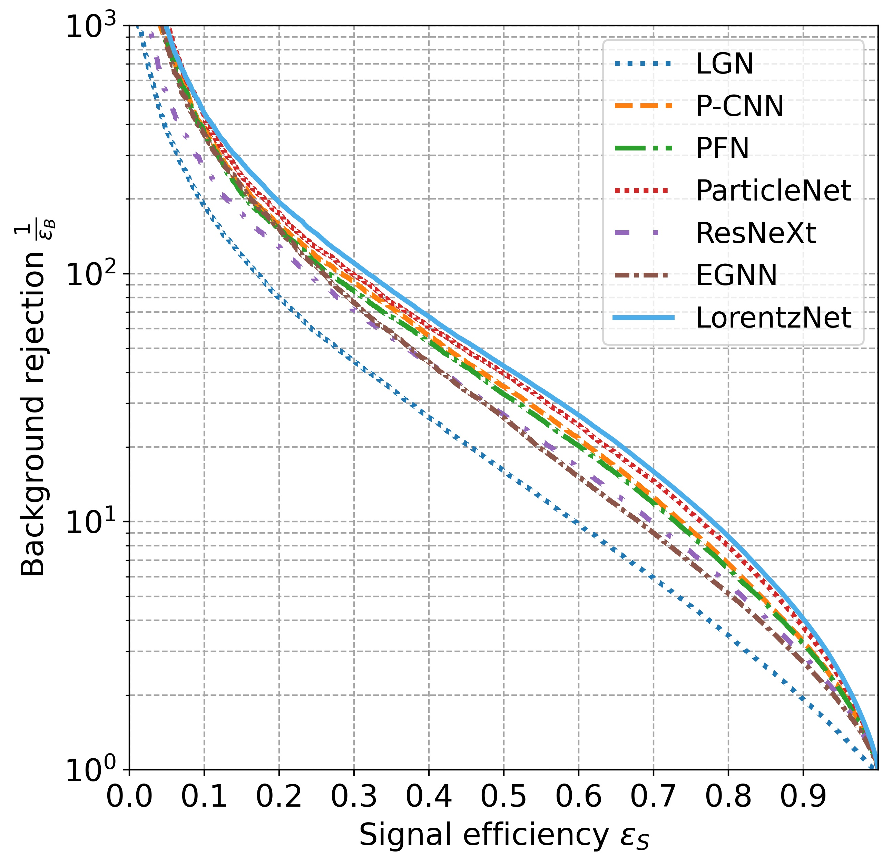

# An Efficient Lorentz Equivariant Graph Neural Network for Jet Tagging


<b>Shiqi Gong, Qi Meng, Jue Zhang, Huilin Qu, Congqiao Li, Sitian Qian, Weitao Du, Zhi-Ming Ma, Tie-Yan Liu</b>

https://arxiv.org/abs/2201.08187

**Abstract:** Deep learning methods have been increasingly adopted to study jets in particle physics. Since symmetry-preserving behavior has been shown to be an important factor for improving the performance of deep learning in many applications, Lorentz group equivariance - a fundamental spacetime symmetry for elementary particles - has recently been incorporated into a deep learning model for jet tagging. However, the design is computationally costly due to the analytic construction of high-order tensors. In this article, we introduce LorentzNet, a new symmetry-preserving deep learning model for jet tagging. The message passing of LorentzNet relies on an efficient Minkowski dot product attention. Experiments on two representative jet tagging benchmarks show that LorentzNet achieves the best tagging performance and improves significantly over existing state-of-the-art algorithms. The preservation of Lorentz symmetry also greatly improves the efficiency and generalization power of the model, allowing LorentzNet to reach highly competitive performance when trained on only a few thousand jets.

<figure>
<p align="center"></p>
<figcaption align = "center"> <b>(left)</b>: The structure of the Lorentz Group Equivariant Block (LGEB). <b>(right)</b>: The network architecture of the LorentzNet. </figcaption>
</figure>

## Table of Contents
<details>
<summary>Click to expand</summary>

- [Requirements](#requirements)
- [Top Tagging](#top-tagging)
  - [Data](#data)
  - [Training](#training)
  - [Evaluation](#evaluation)
  - [Pre-trained Model](#pre-trained-model)
- [Quark-gluon Tagging](#quark-gluon-tagging)
  - [Data](#data-1)
  - [Training](#training-1)
  - [Evaluation](#evaluation-1)
  - [Pre-trained Model](#pre-trained-model-1)
- [ROC Curves](#roc-curves)
- [Equivariance Test](#equivariance-test)
- [Citation](#citation)
- [References](#references)

</details>

## Requirements
- `Python>=3.7`, `PyTorch>=1.9`, and `CUDA toolkit>=10.2`.
- Use the following command to install required packages.
    - ```pip install -r requirements.txt```
- We use 4 GPUs for training and evaluation. However, it is acceptable to use fewer or more GPUs to train or test the model, simply changing the arg `--nproc_per_node=4` to the number of GPUs available.

## Top Tagging

### Data
Top tagging dataset is an open benchmark dataset firstly released in [[1]](#References), which can be downloaded from [zenodo](https://doi.org/10.5281/zenodo.2603256). To extract 4-vectors and labels from the raw data, we follow the data converting process from [LorentzGroupNetwork](https://github.com/fizisist/LorentzGroupNetwork#1-converting-the-dataset) [[2]](#References).

For convenience, the converted top tagging dataset can be downloaded from [this link](https://osf.io/7u3fk/?view_only=8c42f1b112ab4a43bcf208012f9db2df). The default data path is [`./data/top/`](./data/top/); therefore, it is recommended to save the converted dataset to this folder. Otherwise, the arg `--datadir /path/to/data/` can be assigned to specify the data path.

### Training
Parallelly training the LorentzNet on 4 GPUs:

```sh
python -m torch.distributed.launch --nproc_per_node=4 top_tagging.py \
        --batch_size=32 --epochs=35 --warmup_epochs=5 \
        --n_layers=6 --n_hidden=72 --lr=0.001 \
        --c_weight=0.005 --dropout=0.2 --weight_decay=0.01 \
        --exp_name=CustomName
```

One can assign `--exp_name` to identity different runs. 
Model with the best validation accuracy will be saved in log directory as `best-val-model.pt`.

### Evaluation
Given `--exp_name`, use `--test_mode` to evalute the best model on the test dataset. 
```sh
python -m torch.distributed.launch --nproc_per_node=4 top_tagging.py \
        --test_mode --exp_name=CustomName --batch_size=100 \
        --n_layers=6 --n_hidden=72 --c_weight=0.005
```

### Pre-trained Model
Pre-trained model are offered in [`./logs/top/pretrained/`](./logs/top/pretrained/). To test the pre-trained model, use:
```sh
python -m torch.distributed.launch --nproc_per_node=4 top_tagging.py \
        --test_mode --exp_name=pretrained --batch_size=100 \
        --n_layers=6 --n_hidden=72 --c_weight=0.005
```


## Quark-gluon Tagging


### Data


Quark-gluon tagging dataset is originally used in [[3]](#References), we can also download the dataset from [zenodo](https://doi.org/10.5281/zenodo.3164691). However, we do not need to download it manually. We use  the package [EnergyFlow](https://energyflow.network/docs/datasets/) that can automatically download the dataset when needed.

Therefore, data is automatically downloaded to [`./data/qg/`](./data/qg/) by default when we firstly run `qg_tagging.py`. The arg `--datadir /path/to/data/` can be assigned to specify the data path.

### Training
Parallelly training the LorentzNet on 4 GPUs:

```sh
python -m torch.distributed.launch --nproc_per_node=4 qg_tagging.py \
        --batch_size=32 --epochs=35  --warmup_epochs=5 \
        --n_layers=6 --n_hidden=72 --lr=0.001 \
        --c_weight=0.001 --dropout=0.2 --weight_decay=0.01
        --exp_name=CustomName
```
One can assign `--exp_name` to identity different runs. 
Model with the best validation accuracy will be saved in log directory as `best-val-model.pt`.

### Evaluation
Given a specific `--exp_name`, use `--test_mode` to evalute the best model on the test dataset. 
```sh
python -m torch.distributed.launch --nproc_per_node=4 qg_tagging.py \
        --test_mode --exp_name=CustomName --batch_size=100 \
        --n_layers=6 --n_hidden=72 --c_weight=0.001
```

### Pre-trained Model
Pre-trained model are offered in [`./logs/qg/pretrained/`](./logs/qg/pretrained/). To test the pre-trained model, use:
```sh
python -m torch.distributed.launch --nproc_per_node=4 qg_tagging.py \
        --test_mode --exp_name=pretrained --batch_size=100 \
        --n_layers=6 --n_hidden=72 --c_weight=0.001
```
## ROC Curves

            |   
:-------------------------:|:-------------------------:
ROC Curves for Top Tagging | ROC Curves for Quark-gluon Tagging

Scripts and tagging scores for different models are saved in [`./scripts/TopTaggingROC/`](./scripts/TopTaggingROC/) and [`./scripts/QGTaggingROC/`](./scripts/QGTaggingROC/).

## Equivariance Test

<figure>
<p align="center"></p>
<p align = "center">Equivariance test under Lorentz boosts on top tagging dataset.</p>
</figure>

Scripts and tagging accuracies under Lorentz transformations with different $\beta$ are saved in [`./scripts/EquivarianceTest`](./scripts/EquivarianceTest). 

## Citation
If you find this work helpful, please cite our paper:
```
@article{gong2022efficient,
  title={An Efficient Lorentz Equivariant Graph Neural Network for Jet Tagging},
  author={Gong, Shiqi and Meng, Qi and Zhang, Jue and Qu, Huilin and Li, Congqiao and Qian, Sitian and Du, Weitao and Ma, Zhi-Ming and Liu, Tie-Yan},
  journal={arXiv preprint arXiv:2201.08187},
  year={2022}
}
```

## References
[1] Kasieczka, Gregor, et al. "The Machine Learning landscape of top taggers." SciPost Physics 7.1 (2019): 014.

[2] Bogatskiy, Alexander, et al. "Lorentz group equivariant neural network for particle physics." International Conference on Machine Learning. PMLR, 2020.

[3] Komiske, Patrick T., Eric M. Metodiev, and Jesse Thaler. "Energy flow networks: deep sets for particle jets." Journal of High Energy Physics 2019.1 (2019): 1-46.