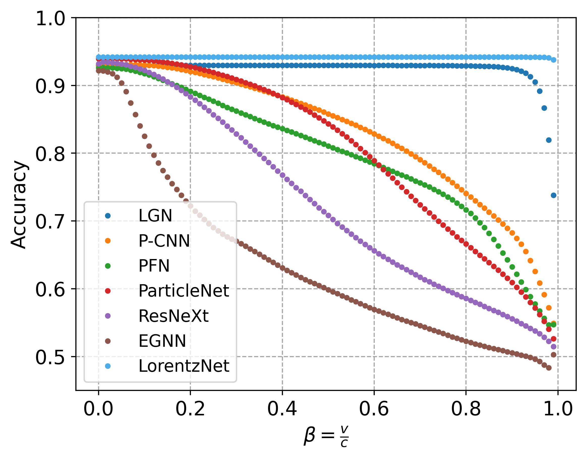

# Equivariance Test

<figure>

<figcaption align = "center">Equivariance test under Lorentz boosts on top tagging dataset.</figcaption>
</figure>

## Introduction
We rotate the top tagging test dataset by Lorentz transformation with different scales of $\beta$ along the $x$-axis, i.e., 
$$\left[\begin{array}{c}
E^{\prime} \\
p_{x}^{\prime} c \\
p_{y}^{\prime} c \\
p_{z}^{\prime} c
\end{array}\right]=\left[\begin{array}{cccc}
\gamma & -\beta \gamma & 0 & 0 \\
-\beta \gamma & \gamma & 0 & 0 \\
0 & 0 & 1 & 0 \\
0 & 0 & 0 & 1
\end{array}\right]\left[\begin{array}{c}
E \\
p_{x} c \\
p_{y} c \\
p_{z} c
\end{array}\right]$$
where $\gamma = \frac{1}{\sqrt{1-\beta^2}}$, $\beta \in [0,1)$, and $c$ is the speed of light. The value of $(E, p_x)$ in the 4-momentum vector will be rotated. As $\beta$ becomes larger, the difference between the distributions of training and test data will become larger. We test the model trained on the original training data, and the tagging accuracy on the rotated test data is reported in above figure. The horizontal axis shows the value of $\beta$ and the vertical axis shows the tagging accuracy on the top tagging dataset under Lorentz transformation with corresponding $\beta$.

## Contents
- Tagging accuracies under different Lorentz transformations are saved in [data](./data). 

- [`plot.py`](./plot.py): draw the figure above.